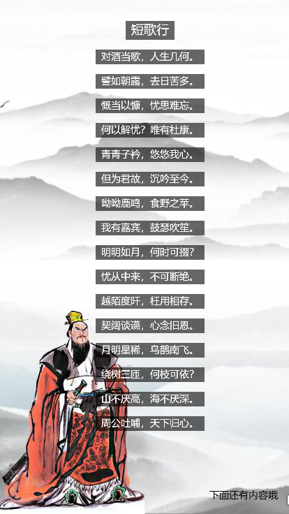
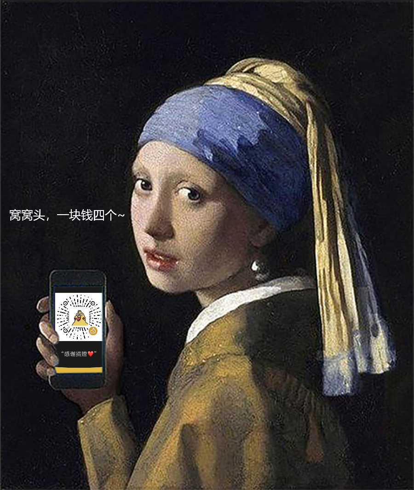

# wxml-to-canvas-render

[](https://github.com/wechat-miniprogram/wxml-to-canvas)

本仓库为 [wxml-to-canvas](https://github.com/wechat-miniprogram/wxml-to-canvas) 外部扩展渲染库（非侵入性，不改变原版API），可以更高效、快速地生成插件需要的数据。当海报中有需要循环的数据时，原版需要复杂的字符串拼接。而通过这个扩展，可以非常方便地做到循环渲染（有点类似与React）。

目前扩展的内容比较简单，大致包含三个部分：

1. DOM树组合
2. DOM树转换
3. 各元素尺寸计算

## 用法

以原生小程序为例：

### 第一步：导入组件

将 `/dist/wxml-to-canvas` 复制到小程序项目的 `components/` 中

``` js
{
  "usingComponents": {
    // 页面中使用相对路径引入
    "wxml-to-canvas": "../../components/wxml-to-canvas" 
  }
}
```

### 第二步：导入函数和工具类

``` js
const {
  el, 
  WTCUtils, 
} = require('../../components/wxml-to-canvas/wtc'); // 注意：扩展库位于 wxml-to-canvas/wtc.js 内
```

### 第三步：定义页面属性

``` js
Page({
  data: {
    src: '', // 用于存放生成的图片路径
    size: null, // 用于存放容器尺寸
  },
  ...
})
```

### 第四步：完善页面

``` html
<view>
  <wxml-to-canvas wx:if="{{size}}" class="widget" width="{{size.width}}" height="{{size.height}}"></wxml-to-canvas>
  <button type="primary" style="margin: 1rem auto;" bindtap="extraImage">生成图片</button>
</view>

<view wx:if="{{src}}">
  <image src="{{src}}" mode="widthFix" style="width: 100vw;" bindtap="viewImage"></image>
  <button type="primary" style="margin: 1rem auto;" bindtap="saveImage">导出图片</button>
</view>
```

### 第五步：创建工具类实例

``` js
onLoad() {
  // 先创建工具类实例，传入画布尺寸
  this.utils = WTCUtils.create(750 * 1.2, 889 * 1.2);

  // 将尺寸注入到页面中
  this.setData({
    size: this.utils.getSize(),
  }, () => {
    // 需要等待页面渲染完成，否则找不到 canvas
    setTimeout(() => {
      // 第四步：构建。
      this.build();
    }, 100);
  });
}
```

### 第四步：构建并渲染
``` js
build() {
  // 通过小程序API获取组件实例
  this.widget = this.selectComponent('.widget');
  
  // 将组件注入到工具类实例中
  this.utils.setWidget(this.widget);

  // 获取容器尺寸
  const size = this.utils.getSize(); // {width: number, height: number}

  // 构建 DOM 树
  const dom = el('view', { // 根容器必须为 view
    class: 'container',
    style: {
      ...size,
      backgroundColor: '#fff',
    },
    children: [
      (() => {
        const backSize = this.utils.widthFix(1152, 1152, 0.26);
        // 定义图片
        return el('image', {
          class: 'qiaFanImage',
          // 图片的 src 属性为必传
          src: 'https://cloud-minapp-37929.cloud.ifanrusercontent.com/1kflAf6K5B5D5ucV.jpg', 
          style: {
            position: 'absolute', // 建议 position 统一传 'absolute'
            left: this.utils.getScaleWidth(55 / size.width),
            top: this.utils.getScaleHeight(600 / size.height),
            ...backSize,
          },
        })
      })(),
      (() => {
        // 定义封面图片
        return el('image', {
          class: 'coverImage',
          src: 'https://cloud-minapp-37929.cloud.ifanrusercontent.com/1kflb1WtHktkL6L0.png',
          style: {
            position: 'absolute',
            top: 0,
            left: 0,
            ...size,
          },
        })
      })(),
      (() => {
        // 定义文字
        return el('text', {
          class: 'heiHei',
          text: '窝窝头，一块钱四个~', // text 必传
          style: {
            position: 'absolute',
            left: this.utils.getScaleWidth(20 / size.width),
            top: this.utils.getScaleHeight(450 / size.height),
            color: '#fff',
            fontSize: 26,
          },
        })
      })(),
    ]
  });

  // 将DOM树转化成插件可读的数据
  const metadata = this.utils.covertElToMetadata(dom);

  // 直接将数据喂给插件即可
  const p1 = this.widget.renderToCanvas(metadata);
  p1.then((res) => {
    console.log('container', res);
  });
}
```


### 第七步：生成图片

``` js
extraImage() {
  wx.showLoading({title: '图片生成中'}).then(() => {
    const p2 = this.widget.canvasToTempFilePath({quality: 0.6, fileType: 'jpg', scale: 1.5});
    
    p2.then(res => {
      // 将生成的图片地址注入页面
      this.setData({ src: res.tempFilePath });
      wx.hideLoading();
    });
  });
}
```

## 效果展示
<div align=center>
  
  <div>多行文字和图片</div>
  
  <div>名画里的秘密</div>
  
  <div>海报</div>
</div>

---

## API

## <b>`el`(tagName: 'view' | 'image' | 'text', attr: WTCElement): `WTCElement`</b>
#### 说明：创建 DOM Element

- tagName 目前官方仅支持 'view' | 'image' | 'text'
- `WTCElement`

``` ts
export interface WTCElement {
  tagName?: string;
  class: string; // 必传，且保证唯一
  style?: WTCCSSStyleDeclaration; // 遵守原插件样式定义
  children?: (WTCElement | null)[]; // 子元素数组
  src?: string; // image 时传入
  text?: string; // text 时传入
}
```

去看看 [原插件样式定义](https://github.com/wechat-miniprogram/wxml-to-canvas#%E6%A0%B7%E5%BC%8F)

- 需要注意的是，原版说每个元素必传 `width` 和 `height`，现在 `text` 已经不需要了，我会默认计算文字的宽高。

## <b>`WTCUtils.create`(containerWidth: number, containerHeight: number): WTCUtils</b>
#### 说明：创建工具类

- containerWidth 默认为屏幕宽度
- containerHeight 默认为屏幕高度

## <b>WTCUtils#`setWidget`(widget: any)</b>
#### 说明：设置官方插件实例 

- widget 官方插件实例

## <b>WTCUtils#`covertElToMetadata`(element: WTCElement, deep = 0): `WTCMetadata`</b>
#### 说明：将 DOM Element 转化为插件需要的数据

- WTCElement 构建完的Element对象
- deep 深度，扩展库自用，误传
- `WTCMetadata`
``` ts
export interface WTCMetadata {
  wxml: string; // 插件需要的 wxml
  style: { [key: string]: WTCCSSStyleDeclaration }; // 插件需要的样式
  width: number; // 容器宽度
  height: number; // 容器高度
}
```

## <b>WTCUtils#`getSize`(): {`width`: number; `height`: number;}</b>
#### 说明：获取容器宽高

- `width` 容器宽度
- `height` 容器高度

## <b>WTCUtils#`widthFix`(originalWidth: number, originalHeight: number, scale = 1): {`width`: number; `height`: number;}</b>
#### 说明：以容器宽度为基准，计算等比缩放的宽高

- originalWidth 原始宽度
- originalHeight 原始高度
- scale 缩放比例
- `width` (与容器等宽) * 缩放比例
- `height` (与容器等宽的同时，按原始宽高比，等比缩放的高度) * 缩放比例

## <b>WTCUtils#`heightFix`(originalWidth: number, originalHeight: number, scale = 1): {`width`: number; `height`: number;}</b>
#### 说明：以容器高度为基准，计算等比缩放的宽高

- originalWidth 原始宽度
- originalHeight 原始高度
- scale 缩放比例
- `width` (与容器等高的同时，按原始宽高比，等比缩放的宽度) * 缩放比例
- `height` (与容器等高) * 缩放比例

## <b>WTCUtils#`getScaleWidth`(scale: number): number</b>
#### 说明：获取缩放后的宽度

- scale 缩放比例

## <b>WTCUtils#`getScaleHeight`(scale: number): number</b>
#### 说明：获取缩放后的高度

- scale 缩放比例

## <b>WTCUtils#`getFontWidth`(text: string, fontSize = 14): number</b>
#### 说明：获取字符串（精确）宽度

- text 字符串

---

## Style 中的附加属性：`textLine`

我在原有style的基础上增加了一个新的属性 `textLine`，顾名思义，这个属性用于多行文本，比如 textLine 传入 2 时，文本元素的高度 = 文字高度 * 2。

## widget.canvasToTempFilePath(`options`) 参数扩展
- options.`fileType` : 'jpg' | 'png'
- options.`quality` : (0, 1] // 目前仅对 jpg 有效
- options.`scale` : 1 // 输出图片的缩放比例，默认为 1

---

## 目录说明
- `/dist/wxml-to-canvas` 为合成版组件，可以独立使用。
- `/examples` 存放了一些使用示例（目前只完善了原生小程序）

## 作者

[@Eusen](https://github.com/Eusen)

## 特别鸣谢

- [@jiangyh](https://github.com/jiangyh) 感谢 `[隔壁小甜]` 第一时间试用并给予支持

## issues

[提个建议？](https://github.com/Eusen/wxml-to-canvas-render/issues/new)